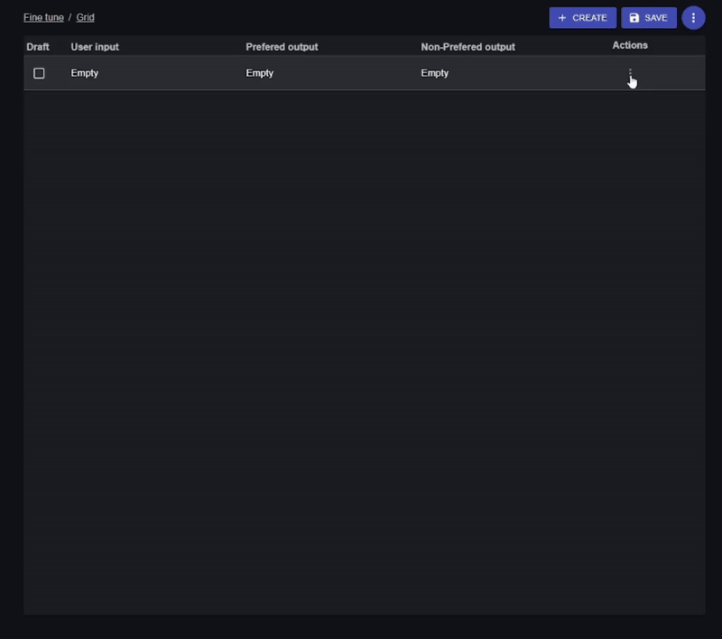

# 🧠 Fine-Tune Dataset Constructor


> This tool is [published to GitHub pages by this link](https://agent-tune.github.io)




A React-based tool for constructing fine-tuning datasets with list and grid forms, featuring the ability to download and upload data as JSONL files compatible with OpenAI's fine-tuning API. This project leverages the `react-declarative` library to create dynamic, interactive forms for defining user inputs, preferred outputs, non-preferred outputs, and chat history, complete with tool definitions and calls.

## Features

- **Dynamic Form Interface**: Create and edit dataset entries using a combination of list and grid layouts.
- **Input Definition**: Specify user input messages with configurable tools and parameters.
- **Output Configuration**: Define preferred and non-preferred outputs with content and associated tools.
- **Tool Management**: Add up to five tools per input/output with customizable arguments (name, type, description, enum, required status).
- **Tool Name Autocomplete**: When selecting tools, the UI provides **autocomplete for tool names**, pulling from defined input tools to streamline selection.
- **Tool Enum Autocomplete**: For arguments with enum values, the form offers **autocomplete for predefined options**, enhancing accuracy and speed.
- **History with Tools**: Include multi-turn conversational context with tool calls in history messages (currently supporting `tool1` per message).
- **Data Persistence**: Save changes to local storage and retrieve them by ID.
- **JSONL Support**: Import/export datasets as JSONL files with automatic generation of unique `tool_call_id`s per OpenAI spec.
- **Material-UI Integration**: Styled with Material-UI components for a modern, responsive UI.
- **Breadcrumbs Navigation**: Easy navigation with save, back, and draft actions.
- **Validation**: Robust checks for tool calls, message order, and history tool consistency.
- **Performance Optimized**: Uses Maps for O(1) lookups in validation and UI callbacks.

## Prerequisites

- Node.js (v16 or higher recommended)
- npm or yarn
- Basic familiarity with React and TypeScript

## Installation

1. **Clone the Repository**:
   ```bash
   git clone https://github.com/<your-username>/<your-repo-name>.git
   cd <your-repo-name>
   ```

2. **Install Dependencies**:
   Using npm:
   ```bash
   npm install
   ```
   Or using yarn:
   ```bash
   yarn install
   ```

3. **Run the Application**:
   ```bash
   npm start
   ```
   Or with yarn:
   ```bash
   yarn start
   ```
   The app will be available at `http://localhost:3000`.

## Usage

1. **Access a Dataset Entry**:
   - Create a new entry by using `+ Create` button on a datagrid page
   - Navigate to an entry using datagrid

2. **Edit Fields**:
   - **Chat History**: Add up to five messages with roles (user, assistant, system, tool) and content. Assistant messages can include a tool call (tool1).
   - **User Input**: Enter message content and define up to five tools with parameters.
   - **Preferred Output**: Specify response content and up to five tool calls with **autocomplete for tool names and enum values**.
   - **Non-Preferred Output**: Define an alternative response.

3. **Save Changes**:
   - Click "Save" in the breadcrumbs to persist to local storage, or "Save as Draft" to store temporarily.
   - Use "Back" to return to the main page, with a confirmation if unsaved changes exist.

4. **Export as JSONL**:
   - Press three dots on a gridview form and use `Export to jsonl`

5. **Import JSONL**:
   - Press three dots on a gridview form and use `Import from jsonl`

6. **Fine-Tune with OpenAI**:
   - Export your dataset and upload it:
     ```bash
     openai api fine_tunes.create -t "path/to/your_dataset.jsonl" -m "base_model_name"
     ```

## Project Structure

- `src/OneView.tsx`: Main component with form logic and UI.
- `src/config/history.ts`: Routing configuration.
- `src/config/storage.ts`: Storage logic for dataset persistence.
- `src/config/draft.ts`: Draft state management.
- `src/validation/`: Validation functions (`validateToolCalls`, `validateMessageOrder`, `validateMessageTools`).
- `fields`: `TypedField` array defining the form structure.

## Dependencies

- `@mui/icons-material`: Material-UI icons.
- `@mui/material`: Material-UI components.
- `lodash-es`: Utility functions (e.g., `get` for safe property access).
- `react-declarative`: Declarative form-building library.

## Data Structure

- **`IStorageItem`**: Fine-tuning example with `input`, `preferred_output`, `non_preferred_output`, and `history`.
- **`IToolDefinition`**: Tool spec with name, description, and up to five arguments.
- **`ITool`**: Tool call with name and up to five key-value arguments.
- **`IHistoryMessage`**: History message with role, content, and one tool call (tool1).

## Technical Highlights

- **Tool History**: Supports tool calls in history, exported with unique `tool_call_id`s.
- **Tool Name Autocomplete**: In `createToolOutput`, the `itemList` for tool names dynamically lists available tools from input definitions, enabling quick selection with autocomplete.
- **Tool Enum Autocomplete**: In `createToolOutputArgument`, enum-based arguments provide a dropdown with autocomplete, sourced from tool definitions, improving data entry efficiency.

## Extending the Project

- **Full JSONL UI**: Add export/import buttons to `<Breadcrumbs2 />` or `<One />` components.
- **Enhanced Validation**: Expand validation rules.
- **Backend**: Replace local storage with an API.
- **Multi-Tool History**: Extend `IHistoryMessage` to support multiple tools.

## Contributing

1. Fork the repository.
2. Create a branch (`git checkout -b feature/<feature-name>`).
3. Commit changes (`git commit -m "Add <feature-name>"`).
4. Push (`git push origin feature/<feature-name>`).
5. Open a pull request.

## License

MIT License - see [LICENSE](LICENSE) for details.
