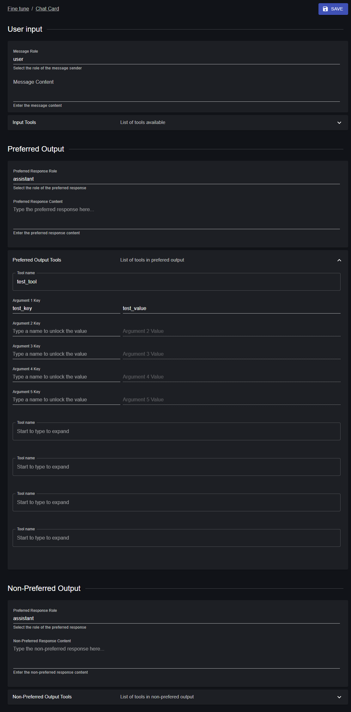

# Fine-Tune Dataset Constructor

> A React-based tool for constructing fine-tuning datasets with list and grid forms, featuring the ability to download and upload data as JSONL files. This project leverages the `react-declarative` library to create dynamic, interactive forms for defining user inputs, preferred outputs, and non-preferred outputs, along with associated tools and their parameters.



## Features

- **Dynamic Form Interface**: Create and edit dataset entries using a combination of list and grid layouts.
- **Input Definition**: Specify user input messages with configurable tools and parameters.
- **Output Configuration**: Define preferred and non-preferred outputs with content and associated tools.
- **Tool Management**: Add up to five tools per input/output with customizable arguments (name, type, description, enum, required status).
- **Data Persistence**: Save changes to local storage and retrieve them by ID.
- **JSONL Support**: Download datasets as JSONL files and upload existing JSONL files for editing (requires additional implementation in storage config).
- **Material-UI Integration**: Styled with Material-UI components for a modern, responsive UI.
- **Breadcrumbs Navigation**: Easy navigation with save and back actions.

## Prerequisites

- Node.js (v16 or higher recommended)
- npm or yarn
- Basic familiarity with React and TypeScript

## Installation

1. **Clone the Repository**:
   ```bash
   git clone https://github.com/<your-username>/<your-repo-name>.git
   cd <your-repo-name>
   ```

2. **Install Dependencies**:
   Using npm:
   ```bash
   npm install
   ```
   Or using yarn:
   ```bash
   yarn install
   ```

3. **Set Up Configuration**:
   - Ensure `history` and `storage` modules are properly configured in `src/config/`.
   - Example `storage.ts`:
     ```typescript
     export interface IStorageItem {
       id: string;
       input: any;
       preferred_output: any;
       non_preferred_output: any;
     }

     const storage = {
       getValue: (): IStorageItem[] => JSON.parse(localStorage.getItem("dataset") || "[]"),
       setValue: (value: IStorageItem[]) => localStorage.setItem("dataset", JSON.stringify(value)),
     };

     export default storage;
     ```

4. **Run the Application**:
   ```bash
   npm start
   ```
   Or with yarn:
   ```bash
   yarn start
   ```
   The app will be available at `http://localhost:3000`.

## Usage

1. **Access a Dataset Entry**:
   - Navigate to a specific entry by passing an `id` prop to the `OneView` component (e.g., `/edit/<id>`).
   - If no entry exists, a new one can be created.

2. **Edit Fields**:
   - **User Input**: Enter the message content and define up to five tools with their parameters.
   - **Preferred Output**: Specify the preferred response content and associated tools.
   - **Non-Preferred Output**: Define an alternative response for comparison.

3. **Save Changes**:
   - Click the "Save" button in the breadcrumbs to persist changes to local storage.
   - Use the "Back" link to save and return to the main page.

4. **Export as JSONL**:
   - (To be implemented) Add a button or action to export the dataset as a `.jsonl` file.
   - Example output:
     ```
     {"id": "1", "input": {"role": "user", "content": "Hello"}, "preferred_output": {"role": "assistant", "content": "Hi there"}, "non_preferred_output": {"role": "assistant", "content": "Goodbye"}}
     ```

5. **Import JSONL**:
   - (To be implemented) Add functionality to upload and parse a `.jsonl` file into the form.

## Project Structure

- `src/OneView.tsx`: Main component containing the form logic and UI.
- `src/config/history.ts`: Routing configuration (e.g., using `history` package).
- `src/config/storage.ts`: Storage logic for persisting dataset entries.
- `fields`: Array of `TypedField` objects defining the form structure.

## Dependencies

- `@mui/icons-material`: Material-UI icons.
- `@mui/material`: Material-UI components.
- `lodash-es`: Utility functions (e.g., `get` for safe property access).
- `react-declarative`: Declarative form-building library.

## Extending the Project

- **JSONL Export/Import**: Add buttons to `Breadcrumbs2` for downloading and uploading `.jsonl` files. Implement file handling in `OneView`.
- **Validation**: Add form validation to ensure required fields are filled.
- **Backend Integration**: Replace local storage with an API for persistent data storage.
- **Styling**: Customize the Material-UI theme for a unique look.

## Contributing

1. Fork the repository.
2. Create a feature branch (`git checkout -b feature/<feature-name>`).
3. Commit your changes (`git commit -m "Add <feature-name>"`).
4. Push to the branch (`git push origin feature/<feature-name>`).
5. Open a pull request.

## License

This project is licensed under the MIT License. See the [LICENSE](LICENSE) file for details.

---

This `README.md` provides a clear overview of the project, its functionality, and how to get started. You can customize the repository URL, add a license file, and expand sections like "Extending the Project" based on future development. Let me know if you'd like further refinements!